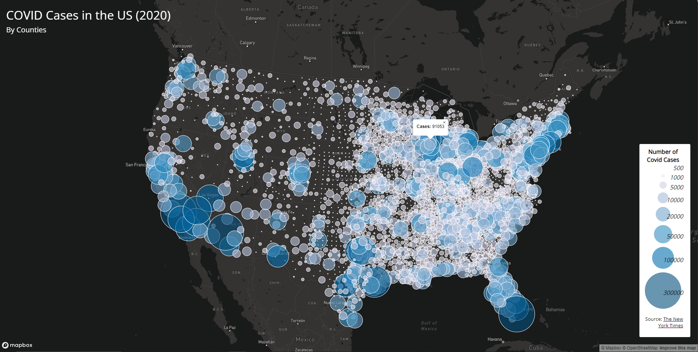
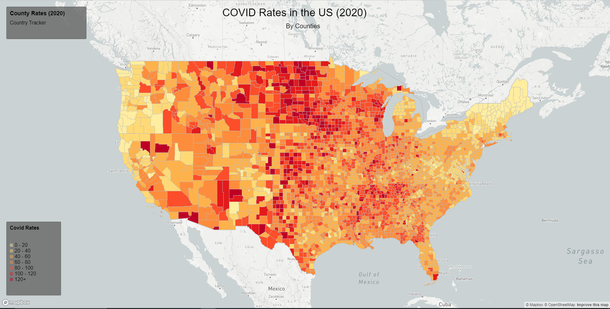

# Mapping US COVID in 2020
For this project, we worked creating a web application that displayed two visual maps. Through the maps, we were able to map the data of the COVID cases and rates in the United States in 2020. The first map that is being displayed is a proportional symbols map that represents the number of COVID cases in the United States. The second map is a chloropleth map of the rates of the COVID cases in the United States. In order to complete the project, the included resources were Mapbox, `mapbox-gl-js.css`, `mapbox-gl-js.js`, [ColorBrewer], [mapeshaper], and [basemap gallery].

## Map 1: Proportional Symbols of COVID Cases in the US in 2020

The [first map] is a proportional symbols map. This map allows the audience to see the number of COVID cases in each counties. This interactive map also allows for the audience to click on a circle to see the exact number of COVID cases that occurred in that specific county/circle.

## Map 2: Chloropeth Map of COVID Rates in the US in 2020

The [second map] is a chloropeth map. This map allows for the viewers to see the rates of COVID in each counties. This interactive map allows for the audience to hover over a specific county. In doing so, the audience will be able to see the name of the county and the rates on the top left legend. 

## Data Source
- [The New York Times](https://github.com/nytimes/covid-19-data/blob/43d32dde2f87bd4dafbb7d23f5d9e878124018b8/live/us-counties.csv)
- [2018 ACS 5 year estimates](https://data.census.gov/table?g=0100000US$050000&d=ACS+5-Year+Estimates+Data+Profiles&tid=ACSDP5Y2018.DP05&hidePreview=true)
- [The US Census Bureau](https://www.census.gov/geographies/mapping-files/time-series/geo/carto-boundary-file.html)
[basemap gallery]:(https://www.mapbox.com/gallery/)
[ColorBrewer]:(https://colorbrewer2.org/#type=sequential&scheme=BuGn&n=3)
[mapshaper]:(https://mapshaper.org/)

[first map]:(https://tuhrong.github.io/COVID-Cases-Analysis/map1.html)
[second map]:(https://tuhrong.github.io/COVID-Cases-Analysis/map2.html)